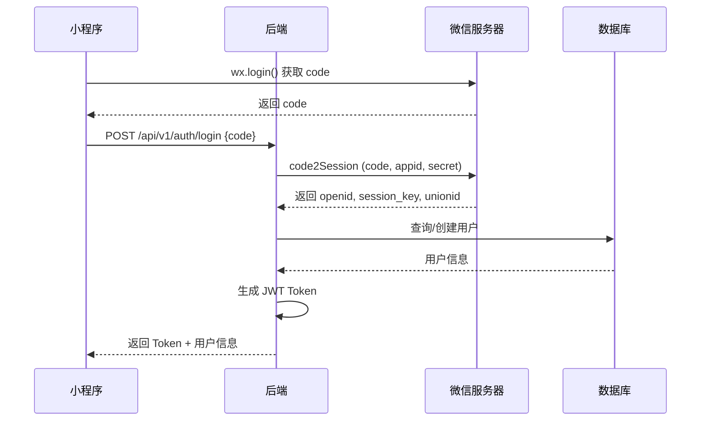

# 薪日 PayDay - 技术方案 v1.0

## 文档信息
- **文档版本**: v1.0
- **创建日期**: 2025-02-11
- **产品名称**: 薪日 PayDay
- **技术负责人**: -
- **文档状态**: 初稿

---

# 一、技术架构总览

## 1.1 整体架构图

```
┌─────────────────────────────────────────────────────────────────┐
│                           客户端层                               │
├──────────────────────────────┬──────────────────────────────────┤
│     微信小程序 (uni-app)      │      Web管理后台 (Vue3)          │
│  - Vue3 + TypeScript         │  - Vue3 + Element Plus           │
│  - Pinia (状态管理)           │  - Vue Router + Pinia            │
│  - UniUI 组件库              │  - Axios + TSRequest             │
│  - ECharts                   │  - ECharts                       │
└──────────────────────────────┴──────────────────────────────────┘
                                    │
                                    │ HTTPS / WSS
                                    ▼
┌─────────────────────────────────────────────────────────────────┐
│                        负载均衡 (Nginx)                         │
│                    SSL 终止 + 反向代理 + 静态资源                │
└─────────────────────────────────────────────────────────────────┘
                                    │
                    ┌───────────────┴───────────────┐
                    ▼                               ▼
┌──────────────────────────────┐  ┌─────────────────────────────┐
│      FastAPI 主服务           │  │      FastAPI 风控服务        │
│  - 用户认证与授权             │  │  - 内容审核                  │
│  - 业务逻辑处理               │  │  - 敏感词过滤                │
│  - 数据 CRUD                 │  │  - 图片识别                  │
│  - WebSocket 推送            │  │  - 风控评分                  │
│  - 定时任务                  │  │  - 队列处理                  │
└──────────────────────────────┘  └─────────────────────────────┘
                    │                               │
                    └───────────────┬───────────────┘
                                    ▼
┌─────────────────────────────────────────────────────────────────┐
│                        数据层                                   │
├──────────────┬──────────────┬──────────────┬───────────────────┤
│   MySQL 8.0  │    Redis     │  对象存储    │   消息队列        │
│  - 主从复制  │  - 缓存      │  - 腾讯云COS │  - Celery/Redis   │
│  - 读写分离  │  - Session   │  - 图片/视频 │  - 异步任务       │
│  - 分库分表  │  - 计数器    │  - 备份     │  - 定时任务       │
│  - 数据加密  │  - 排行榜    │             │                   │
└──────────────┴──────────────┴──────────────┴───────────────────┘
                                    │
                                    ▼
┌─────────────────────────────────────────────────────────────────┐
│                        第三方服务                               │
├──────────────┬──────────────┬──────────────┬───────────────────┤
│  微信小程序  │   内容安全   │   短信/邮件  │    监控告警       │
│  - 登录授权  │  - 腾讯云天御 │  - 腾讯云    │  - Sentry         │
│  - 订阅消息  │  - 图片审核  │  - 阿里云    │  - Prometheus     │
│  - 用户信息  │  - 文本审核  │              │  - Grafana        │
└──────────────┴──────────────┴──────────────┴───────────────────┘
```

## 1.2 技术栈选型

### 1.2.1 前端技术栈

#### 小程序端 (uni-app)
```yaml
核心框架:
  - uni-app: Vue3 + Vite
  - TypeScript: ^5.0
  - Pinia: 状态管理
  - UniUI: 官方组件库

生态工具:
  - uni-app-plus: 原生能力扩展
  - uni-simple-router: 路由管理
  - uni-ui: UI组件库

数据可视化:
  - ECharts: 图表库
  - uni-ec-canvas: 小程序ECharts组件

开发工具:
  - HBuilderX / VS Code
  - 微信开发者工具
```

#### Web管理后台
```yaml
核心框架:
  - Vue3: Composition API
  - TypeScript: ^5.0
  - Vite: ^5.0

UI框架:
  - Element Plus: UI组件库
  - @element-plus/icons-vue: 图标库

状态与路由:
  - Pinia: 状态管理
  - Vue Router: 路由管理

HTTP客户端:
  - Axios: HTTP请求
  - 类型化请求封装

数据可视化:
  - ECharts: 图表
  - vue-echarts: Vue3封装

开发工具:
  - VS Code + Volar
```

### 1.2.2 后端技术栈

```yaml
核心框架:
  - FastAPI: ^0.104
  - Python: ^3.11
  - Pydantic: 数据验证
  - SQLAlchemy: ORM
  - Alembic: 数据库迁移

异步处理:
  - Celery: 任务队列
  - Redis: 消息代理
  - APScheduler: 定时任务

认证安全:
  - python-jose: JWT
  - passlib: 密码哈希
  - cryptography: 加密库
  - aioredis: Redis异步客户端

数据库:
  - MySQL: 8.0+
  - Redis: 7.0+
  - aiomysql: MySQL异步驱动
  - pymysql: MySQL同步驱动

文件存储:
  - cos-python-sdk-v5: 腾讯云COS
  - Pillow: 图片处理

第三方服务:
  - WeChatSDK: 微信小程序SDK
  - tencentcloud-sdk-python: 腾讯云服务
    - 天御: 内容安全
    - OCR: 图片文字识别

开发工具:
  - pytest: 测试框架
  - black: 代码格式化
  - ruff: 代码检查
  - mypy: 类型检查
```

### 1.2.3 基础设施
```yaml
容器化:
  - Docker: 容器化
  - Docker Compose: 本地开发

Web服务器:
  - Nginx: 反向代理 + 静态资源
  - Gunicorn: ASGI服务器
  - Uvicorn: ASGI实现

监控日志:
  - Prometheus: 指标收集
  - Grafana: 可视化
  - Sentry: 错误追踪
  - ELK Stack: 日志分析

CI/CD:
  - Git: 版本控制
  - GitHub Actions: 持续集成
```

---

# 二、系统设计

## 2.1 服务拆分

### 2.1.1 主服务 (Main Service)
**职责**: 核心业务逻辑处理

**功能模块**:
```python
app/
├── api/                    # API路由
│   ├── v1/
│   │   ├── auth.py        # 认证相关
│   │   ├── user.py        # 用户管理
│   │   ├── payday.py      # 发薪日管理
│   │   ├── salary.py      # 工资记录
│   │   ├── post.py        # 社区帖子
│   │   ├── comment.py     # 评论
│   │   ├── like.py        # 点赞
│   │   ├── follow.py      # 关注
│   │   ├── notification.py # 通知
│   │   └── statistics.py  # 统计数据
│   └── admin/             # 管理后台API
│       ├── user.py
│       ├── content.py
│       ├── risk.py
│       └── system.py
├── core/                   # 核心配置
│   ├── config.py          # 配置管理
│   ├── security.py        # 安全相关
│   ├── deps.py            # 依赖注入
│   └── constants.py       # 常量定义
├── models/                 # 数据模型
│   ├── user.py
│   ├── payday.py
│   ├── salary.py
│   ├── post.py
│   ├── comment.py
│   └── risk.py
├── schemas/                # Pydantic模式
│   ├── user.py
│   ├── payday.py
│   ├── salary.py
│   ├── post.py
│   └── common.py
├── services/               # 业务服务层
│   ├── auth_service.py
│   ├── user_service.py
│   ├── payday_service.py
│   ├── salary_service.py
│   ├── post_service.py
│   ├── notification_service.py
│   └── stats_service.py
├── utils/                  # 工具函数
│   ├── wechat.py          # 微信工具
│   ├── encryption.py      # 加密工具
│   ├── image.py           # 图片处理
│   └── date.py            # 日期工具
└── middleware/             # 中间件
    ├── auth.py
    ├── rate_limit.py
    └── logging.py
```

### 2.1.2 风控服务 (Risk Service)
**职责**: 内容审核与风控评分

**功能模块**:
```python
risk_service/
├── api/
│   └── v1/
│       └── risk.py        # 风控审核API
├── services/
│   ├── text_check.py     # 文本审核
│   ├── image_check.py    # 图片审核
│   ├── risk_scoring.py   # 风控评分
│   └── sensitive_words.py # 敏感词管理
├── detectors/
│   ├── spam_detector.py  # 垃圾内容检测
│   ├── contact_detector.py # 联系方式检测
│   └── ocr_detector.py   # OCR检测
└── utils/
    ├── tencent_yu.py     # 腾讯云天御
    └── image_mosaic.py   # 图片打码
```

---

## 2.2 数据库设计

### 2.2.1 分库分表策略

**分库策略**: 按业务模块分库
```
payday_main      # 主库: 用户、发薪日配置
payday_content   # 内容库: 帖子、评论
payday_salary    # 工资库: 工资记录
payday_risk      # 风控库: 风控审核记录
payday_stats     # 统计库: 统计数据(可选用时序数据库)
```

**分表策略**:
| 表名 | 分表键 | 分表方式 | 说明 |
|------|--------|----------|------|
| posts | created_at | 按月分表 | 按月创建表 posts_202501, posts_202502... |
| comments | post_id | 哈希分表 | 按 post_id 哈希值分16张表 |
| salary_records | user_id + created_at | 按月分表 | 按用户和月份复合分表 |
| notifications | user_id | 哈希分表 | 按用户ID哈希分8张表 |

### 2.2.2 索引优化策略

**复合索引设计**:
```sql
-- 帖子表
CREATE INDEX idx_posts_hot ON posts(type, status, risk_status, like_count, created_at);
CREATE INDEX idx_posts_user ON posts(user_id, status, created_at);
CREATE INDEX idx_posts_tag ON posts(type, city, industry, created_at);

-- 评论表
CREATE INDEX idx_comments_hot ON comments(post_id, created_at);
CREATE INDEX idx_comments_user ON comments(user_id, created_at);

-- 工资记录表
CREATE INDEX idx_salary_user_date ON salary_records(user_id, payday_date DESC);
CREATE INDEX idx_salary_stats ON salary_records(user_id, created_at);
```

### 2.2.3 数据加密方案

**敏感字段加密**:
```python
from cryptography.fernet import Fernet
import base64
import hashlib

class EncryptionService:
    """数据加密服务"""

    def __init__(self, secret_key: str):
        # 使用密钥派生函数生成加密密钥
        key = hashlib.sha256(secret_key.encode()).digest()
        self.cipher = Fernet(base64.urlsafe_b64encode(key))

    def encrypt_amount(self, amount: float) -> str:
        """加密工资金额"""
        amount_str = str(amount)
        return self.cipher.encrypt(amount_str.encode()).decode()

    def decrypt_amount(self, encrypted: str) -> float:
        """解密工资金额"""
        decrypted = self.cipher.decrypt(encrypted.encode()).decode()
        return float(decrypted)

    def encrypt_sensitive_data(self, data: str) -> str:
        """加密敏感文本数据"""
        return self.cipher.encrypt(data.encode()).decode()

    def decrypt_sensitive_data(self, encrypted: str) -> str:
        """解密敏感文本数据"""
        return self.cipher.decrypt(encrypted.encode()).decode()
```

**数据库字段加密存储**:
```sql
-- 工资记录表 - 金额字段加密存储
CREATE TABLE salary_records (
  id VARCHAR(36) PRIMARY KEY,
  user_id VARCHAR(36) NOT NULL,
  amount_encrypted TEXT NOT NULL COMMENT '加密后的金额',
  -- 不再存储 amount 明文字段

  -- 解密视图(仅用于统计查询，严格控制权限)
  -- 使用视图解密时需要应用层权限验证
);
```

---

## 2.3 缓存设计

### 2.3.1 Redis 数据结构设计

```python
# 用户会话
# Key: session:{session_id}
# Value: JWT Token
# TTL: 7天
session:{session_id} = "eyJhbGciOiJIUzI1NiIs..."

# 用户信息缓存
# Key: user:info:{user_id}
# Value: JSON(UserProfile)
# TTL: 1小时
user:info:{user_id} = {
  "id": "xxx",
  "anonymous_name": "匿名用户_8a3f",
  "avatar": "https://...",
  "follower_count": 123,
  "following_count": 45
}

# 发薪日缓存
# Key: payday:status:{user_id}:{date}
# Value: JSON(PaydayStatus)
# TTL: 1天
payday:status:{user_id}:{date} = {
  "is_payday_today": true,
  "days_until_payday": 0,
  "current_mood": "happy"
}

# 帖子热度排行榜
# Key: post:hot:{date}
# Type: Sorted Set
# Score: 综合热度分
# Member: post_id
ZADD post:hot:20250211 123.5 "post_id_1"
ZADD post:hot:20250211 98.2 "post_id_2"

# 帖子浏览计数
# Key: post:view:{post_id}
# TTL: 永久
INCR post:view:{post_id}

# 点赞状态缓存
# Key: like:status:{user_id}:{target_type}:{target_id}
# Value: 1/0 (已赞/未赞)
# TTL: 7天
SET like:status:user123:post:post456 "1"
EXPIRE like:status:user123:post:post456 604800

# 关注关系缓存
# Key: follow:list:{user_id}:following
# Type: Set
SADD follow:list:user123:following "user456"
SADD follow:list:user123:following "user789"

# 风控结果缓存
# Key: risk:check:{target_type}:{target_id}
# Value: JSON(RiskCheckResult)
# TTL: 30天
risk:check:post:post123 = {
  "status": "approved",
  "score": 25,
  "reasons": []
}

# 接口限流
# Key: rate_limit:api:{user_id}:{endpoint}
# TTL: 按限流周期
INCR rate_limit:api:user123:/api/v1/posts
EXPIRE rate_limit:api:user123:/api/v1/posts 60
```

### 2.3.2 缓存更新策略

**Cache-Aside 模式**:
```python
async def get_user_profile(user_id: str) -> UserProfile:
    # 1. 先查缓存
    cache_key = f"user:info:{user_id}"
    cached = await redis.get(cache_key)

    if cached:
        return UserProfile.parse_raw(cached)

    # 2. 缓存未命中，查数据库
    user = await db.query(User).filter(User.id == user_id).first()

    # 3. 写入缓存
    await redis.setex(
        cache_key,
        3600,  # 1小时
        user.json()
    )

    return user

async def update_user_profile(user_id: str, data: dict):
    # 1. 更新数据库
    await db.query(User).filter(User.id == user_id).update(data)

    # 2. 删除缓存
    cache_key = f"user:info:{user_id}"
    await redis.delete(cache_key)
```

**热点数据预热**:
```python
# 每日凌晨预热当日热门帖子
async def preheat_hot_posts():
    today = datetime.now().strftime("%Y%m%d")

    # 从数据库获取昨日热门帖子
    hot_posts = await db.query(Post)\
        .filter(Post.created_at >= yesterday_start)\
        .order_by(Post.like_count.desc())\
        .limit(100)\
        .all()

    # 写入 Redis 排行榜
    pipe = redis.pipeline()
    for post in hot_posts:
        score = calculate_hot_score(post)
        pipe.zadd(f"post:hot:{today}", {post.id: score})

    await pipe.execute()
```

---

## 2.4 消息队列设计

### 2.4.1 异步任务定义

```python
from celery import Celery

celery_app = Celery(
    "payday",
    broker="redis://localhost:6379/0",
    backend="redis://localhost:6379/1"
)

# 风控审核任务
@celery_app.task(bind=True, max_retries=3)
def risk_check_task(self, target_id: str, target_type: str, user_id: str):
    """
    异步风控审核任务
    """
    try:
        risk_service = RiskCheckService()
        result = risk_service.check_content(
            target_id=target_id,
            target_type=target_type,
            user_id=user_id
        )

        # 更新审核状态
        update_risk_status(target_id, result)

        # 如果拒绝，发送通知
        if result.status == "rejected":
            send_rejection_notification(user_id, result.reasons)

        return result

    except Exception as e:
        # 重试机制
        raise self.retry(exc=e, countdown=60)

# 内容审核任务
@celery_app.task
def content_moderation_task(post_id: str):
    """
    内容审核任务: 文本 + 图片
    """
    post = get_post(post_id)

    # 文本审核
    text_result = tencent_yu.text_moderation(post.content)

    # 图片审核
    image_results = []
    for image_url in post.images:
        result = tencent_yu.image_moderation(image_url)
        image_results.append(result)

    # OCR 提取图片文字并审核
    ocr_results = []
    for image_url in post.images:
        text = tencent_ocr.extract_text(image_url)
        if text:
            ocr_result = tencent_yu.text_moderation(text)
            ocr_results.append(ocr_result)

    # 综合判定
    final_decision = make_final_decision(
        text_result, image_results, ocr_results
    )

    # 更新状态
    update_post_risk_status(post_id, final_decision)

# 统计数据计算任务
@celery_app.task
def calculate_user_stats_task(user_id: str):
    """
    计算用户统计数据
    """
    stats = {
        "post_count": count_user_posts(user_id),
        "follower_count": count_user_followers(user_id),
        "following_count": count_user_following(user_id),
        "total_likes": count_user_likes(user_id),
    }

    update_user_stats(user_id, stats)

# 发薪日提醒任务
@celery_app.task
def send_payday_reminder():
    """
    定时任务: 每日检查并提醒即将发薪的用户
    """
    # 查询明天发薪的用户
    users = get_users_payday_tomorrow()

    for user in users:
        send_wechat_subscription_message(
            user_id=user.id,
            template_id="xxx",
            data={
                "thing1": {"value": "工资到账提醒"},
                "date2": {"value": "明天"},
            }
        )

# 定时清理任务
@celery_app.task
def cleanup_expired_data():
    """
    定时清理过期数据
    """
    # 删除30天前的已读通知
    delete_old_notifications(days=30)

    # 删除90天前的已拒绝风控记录
    delete_old_risk_records(days=90)

    # 清理Redis过期缓存
    # Redis自动过期，无需手动清理

# 配置 Celery Beat 定时任务
from celery.schedules import crontab

celery_app.conf.beat_schedule = {
    "payday-reminder-daily": {
        "task": "tasks.send_payday_reminder",
        "schedule": crontab(hour=8, minute=0),  # 每天早上8点
    },
    "cleanup-expired-data": {
        "task": "tasks.cleanup_expired_data",
        "schedule": crontab(hour=2, minute=0),  # 每天凌晨2点
    },
    "calculate-daily-stats": {
        "task": "tasks.calculate_daily_stats",
        "schedule": crontab(hour=3, minute=0),  # 每天凌晨3点
    },
}
```

---

# 三、核心模块技术实现

## 3.1 微信小程序登录

### 3.1.1 登录流程



### 3.1.2 代码实现

```python
# core/config.py
class Settings(BaseSettings):
    # 微信小程序配置
    WECHAT_APP_ID: str
    WECHAT_APP_SECRET: str

    # JWT配置
    JWT_SECRET_KEY: str
    JWT_ALGORITHM: str = "HS256"
    ACCESS_TOKEN_EXPIRE_MINUTES: int = 7 * 24 * 60  # 7天

# api/v1/auth.py
from fastapi import APIRouter, Depends, HTTPException
from core import security
from services import wechat_service, user_service

router = APIRouter()

@router.post("/login")
async def login(code: str):
    """
    微信小程序登录

    Args:
        code: wx.login() 获取的临时凭证
    """
    # 1. 通过 code 换取 openid
    wechat_data = await wechat_service.code2session(code)
    openid = wechat_data.get("openid")

    if not openid:
        raise HTTPException(status_code=400, detail="获取 openid 失败")

    # 2. 查询或创建用户
    user = await user_service.get_or_create_user(openid)

    # 3. 生成 JWT Token
    access_token = security.create_access_token(
        data={"sub": user.id, "openid": openid}
    )

    # 4. 返回用户信息和 Token
    return {
        "access_token": access_token,
        "token_type": "bearer",
        "user": {
            "id": user.id,
            "anonymous_name": user.anonymous_name,
            "avatar": user.avatar,
            "is_new": user.created_at == user.updated_at,  # 判断是否新用户
        }
    }
```

```python
# services/wechat_service.py
import httpx
from core.config import settings

class WeChatService:
    """微信服务"""

    async def code2session(self, code: str) -> dict:
        """
        通过 code 换取 openid 和 session_key
        """
        url = "https://api.weixin.qq.com/sns/jscode2session"
        params = {
            "appid": settings.WECHAT_APP_ID,
            "secret": settings.WECHAT_APP_SECRET,
            "js_code": code,
            "grant_type": "authorization_code"
        }

        async with httpx.AsyncClient() as client:
            response = await client.get(url, params=params)
            data = response.json()

            if "errcode" in data:
                raise Exception(f"微信登录失败: {data.get('errmsg')}")

            return data

wechat_service = WeChatService()
```

```python
# core/security.py
from datetime import datetime, timedelta
from jose import JWTError, jwt
from core.config import settings

def create_access_token(data: dict, expires_delta: timedelta = None):
    """
    创建 JWT Token
    """
    to_encode = data.copy()

    if expires_delta:
        expire = datetime.utcnow() + expires_delta
    else:
        expire = datetime.utcnow() + timedelta(
            minutes=settings.ACCESS_TOKEN_EXPIRE_MINUTES
        )

    to_encode.update({"exp": expire})
    encoded_jwt = jwt.encode(
        to_encode,
        settings.JWT_SECRET_KEY,
        algorithm=settings.JWT_ALGORITHM
    )

    return encoded_jwt

def decode_access_token(token: str) -> dict:
    """
    解析 JWT Token
    """
    try:
        payload = jwt.decode(
            token,
            settings.JWT_SECRET_KEY,
            algorithms=[settings.JWT_ALGORITHM]
        )
        return payload
    except JWTError:
        return None
```

---

## 3.2 风控系统实现

### 3.2.1 风控架构

```python
# services/risk_scoring.py
from typing import List, Dict
from enum import Enum

class RiskLevel(Enum):
    LOW = 1      # 0-30分: 通过
    MEDIUM = 2   # 31-70分: 人工复核
    HIGH = 3     # 71-100分: 拒绝

class RiskScoringService:
    """风控评分服务"""

    # 风控规则权重配置
    WEIGHTS = {
        "sensitive_words": 90,    # 敏感词
        "contact_info": 80,       # 联系方式
        "spam": 70,               # 垃圾内容
        "porn_image": 95,         # 色情图片
        "violence_image": 95,     # 暴力图片
        "ad_image": 60,           # 广告图片
        "frequency": 50,          # 频率
        "reputation": 30,         # 信誉
    }

    async def calculate_score(
        self,
        user_id: str,
        content: str,
        images: List[str] = None
    ) -> Dict:
        """
        计算风控评分

        Returns:
            {
                "score": int,           # 总分 0-100
                "level": RiskLevel,
                "reasons": List[str],
                "action": str,          # approve/reject/manual
            }
        """
        total_score = 0
        reasons = []

        # 1. 文本内容检测
        text_score, text_reasons = await self._check_text(content)
        total_score = max(total_score, text_score)
        reasons.extend(text_reasons)

        # 2. 图片内容检测
        if images:
            image_score, image_reasons = await self._check_images(images)
            total_score = max(total_score, image_score)
            reasons.extend(image_reasons)

        # 3. 用户行为评分
        behavior_score, behavior_reasons = await self._check_user_behavior(user_id)
        total_score = max(total_score, behavior_score)
        reasons.extend(behavior_reasons)

        # 4. 判定风控等级
        if total_score >= 80:
            level = RiskLevel.HIGH
            action = "reject"
        elif total_score >= 50:
            level = RiskLevel.MEDIUM
            action = "manual"
        else:
            level = RiskLevel.LOW
            action = "approve"

        return {
            "score": total_score,
            "level": level,
            "reasons": list(set(reasons)),
            "action": action
        }

    async def _check_text(self, content: str) -> tuple:
        """文本检测"""
        score = 0
        reasons = []

        # 敏感词检测
        sensitive_words = await sensitive_words_service.check(content)
        if sensitive_words:
            score = max(score, self.WEIGHTS["sensitive_words"])
            reasons.append(f"命中敏感词: {', '.join(sensitive_words)}")

        # 联系方式检测
        if contact_detector.has_contact_info(content):
            score = max(score, self.WEIGHTS["contact_info"])
            reasons.append("包含联系方式")

        # 垃圾内容检测
        if spam_detector.is_spam(content):
            score = max(score, self.WEIGHTS["spam"])
            reasons.append("疑似垃圾内容")

        return score, reasons

    async def _check_images(self, images: List[str]) -> tuple:
        """图片检测"""
        score = 0
        reasons = []

        for image_url in images:
            # 调用腾讯云图片审核
            result = await tencent_yu.image_moderation(image_url)

            if result.get("porn"):
                score = max(score, self.WEIGHTS["porn_image"])
                reasons.append("包含色情图片")

            if result.get("violence"):
                score = max(score, self.WEIGHTS["violence_image"])
                reasons.append("包含暴力图片")

            if result.get("ad"):
                score = max(score, self.WEIGHTS["ad_image"])
                reasons.append("包含广告图片")

            # OCR 提取文字并检测
            ocr_text = await tencent_ocr.extract_text(image_url)
            if ocr_text:
                ocr_score, ocr_reasons = await self._check_text(ocr_text)
                score = max(score, ocr_score)
                reasons.extend([f"图片文字: {r}" for r in ocr_reasons])

        return score, reasons

    async def _check_user_behavior(self, user_id: str) -> tuple:
        """用户行为检测"""
        score = 0
        reasons = []

        # 发帖频率检测
        post_count = await redis.get(f"post:frequency:{user_id}")
        if post_count and int(post_count) > 5:
            score = max(score, self.WEIGHTS["frequency"])
            reasons.append("发帖频率过高")

        # 信誉分检测
        user = await user_service.get_user(user_id)
        if user.reputation_score < 60:
            score = max(score, self.WEIGHTS["reputation"])
            reasons.append("信誉分过低")

        return score, reasons

risk_scoring_service = RiskScoringService()
```

### 3.2.2 腾讯云天御集成

```python
# utils/tencent_yu.py
from tencentcloud.common import credential
from tencentcloud.common.profile.client_profile import ClientProfile
from tencentcloud.common.profile.http_profile import HttpProfile
from tencentcloud.ims.v20201229 import ims_client, models
from tencentcloud.tms.v20200713 import tms_client, models as tms_models
from core.config import settings

class TencentYuService:
    """腾讯云天御内容安全服务"""

    def __init__(self):
        # 初始化认证
        cred = credential.Credential(
            settings.TENCENT_SECRET_ID,
            settings.TENCENT_SECRET_KEY
        )

        # 图片审核客户端
        self.ims_client = ims_client.ImsClient(
            cred,
            settings.TENCENT_REGION,
            profile=ClientProfile()
        )

        # 文本审核客户端
        self.tms_client = tms_client.TmsClient(
            cred,
            settings.TENCENT_REGION,
            profile=ClientProfile()
        )

    async def image_moderation(self, image_url: str) -> dict:
        """
        图片审核

        Returns:
            {
                "porn": bool,        # 色情
                "violence": bool,    # 暴力
                "ad": bool,          # 广告
                "suggestion": str,   # pass/review/block
            }
        """
        req = models.ImageModerationRequest()
        params = {
            "ImageUrl": image_url,
            "BizType": "payday_risk_check"
        }
        req.from_json_string(json.dumps(params))

        resp = self.ims_client.ImageModeration(req)

        result = {
            "porn": resp.Suggestion == "block" and "Porn" in resp.Labels,
            "violence": resp.Suggestion == "block" and "Violence" in resp.Labels,
            "ad": resp.Suggestion == "block" and "Ad" in resp.Labels,
            "suggestion": resp.Suggestion
        }

        return result

    async def text_moderation(self, content: str) -> dict:
        """
        文本审核

        Returns:
            {
                "suggestion": str,   # pass/review/block
                "labels": List[str],
                "details": List[dict]
            }
        """
        req = tms_models.TextModerationRequest()
        params = {
            "Content": base64.b64encode(content.encode()).decode(),
            "BizType": "payday_risk_check"
        }
        req.from_json_string(json.dumps(params))

        resp = self.tms_client.TextModeration(req)

        return {
            "suggestion": resp.Suggestion,
            "labels": resp.Labels,
            "details": resp.DetailResults
        }

tencent_yu = TencentYuService()
```

### 3.2.3 图片打码实现

```python
# utils/image_mosaic.py
from PIL import Image, ImageDraw
import io
import re

class ImageMosaicService:
    """图片打码服务 - 工资截图敏感信息脱敏"""

    # 手机号正则
    PHONE_PATTERN = re.compile(r'1[3-9]\d{9}')

    # 身份证号正则
    ID_CARD_PATTERN = re.compile(r'\d{17}[\dXx]')

    # 姓名正则(中文)
    NAME_PATTERN = re.compile(r'[\u4e00-\u9fa5]{2,3}(?:\s|:|：|先生|女士)')

    async def mosaic_salary_image(self, image_url: str) -> str:
        """
        对工资截图进行自动打码

        Args:
            image_url: 原始图片URL

        Returns:
            打码后的图片URL
        """
        # 1. 下载图片
        image_bytes = await self._download_image(image_url)
        image = Image.open(io.BytesIO(image_bytes))

        # 2. OCR 提取文字
        text_data = await tencent_ocr.extract_text_with_positions(image_url)

        # 3. 识别敏感信息位置
        sensitive_boxes = []
        for item in text_data:
            text = item["text"]
            position = item["position"]  # {x, y, width, height}

            # 检测是否为敏感信息
            if self._is_sensitive(text):
                sensitive_boxes.append(position)

        # 4. 在敏感信息位置打码
        if sensitive_boxes:
            image = self._apply_mosaic(image, sensitive_boxes)

        # 5. 上传打码后的图片
        mosaic_url = await self._upload_image(image)

        return mosaic_url

    def _is_sensitive(self, text: str) -> bool:
        """判断文本是否为敏感信息"""
        if self.PHONE_PATTERN.search(text):
            return True
        if self.ID_CARD_PATTERN.search(text):
            return True
        if self.NAME_PATTERN.search(text):
            return True
        return False

    def _apply_mosaic(self, image: Image.Image, boxes: List[dict]) -> Image.Image:
        """应用马赛克"""
        draw = ImageDraw.Draw(image)

        for box in boxes:
            x, y = box["x"], box["y"]
            w, h = box["width"], box["height"]

            # 提取区域
            region = image.crop((x, y, x + w, y + h))

            # 缩小再放大实现马赛克
            small = region.resize((w // 10, h // 10), Image.BILINEAR)
            mosaic = small.resize((w, h), Image.BILINEAR)

            # 粘贴回原图
            image.paste(mosaic, (x, y))

        return image

image_mosaic_service = ImageMosaicService()
```

---

## 3.3 社区功能实现

### 3.3.1 帖子热度算法

```python
# services/post_service.py
class PostService:
    """帖子服务"""

    async def calculate_hot_score(self, post: Post) -> float:
        """
        计算帖子热度分

        算法参考 Reddit 热度算法，结合时间衰减

        Score = log10(likes + comments * 2) + (created_at - epoch) / 45000
        """
        import math
        from datetime import datetime, timezone

        # 基础互动分
        interaction_score = math.log10(
            max(1, post.like_count + post.comment_count * 2)
        )

        # 时间衰减 (45小时为一个周期)
        epoch = datetime(1970, 1, 1, tzinfo=timezone.utc)
        time_diff = (post.created_at - epoch).total_seconds()
        time_score = time_diff / 162000  # 45000秒

        # 帖子类型加成
        type_bonus = {
            "complaint": 1.0,
            "sharing": 1.2,
            "question": 1.1
        }
        bonus = type_bonus.get(post.type, 1.0)

        # 最终热度分
        hot_score = (interaction_score + time_score) * bonus

        return hot_score

    async def get_hot_posts(
        self,
        date: str = None,
        limit: int = 20
    ) -> List[Post]:
        """
        获取热门帖子

        优先从 Redis 排行榜获取，不存在则计算
        """
        redis_key = f"post:hot:{date or datetime.now().strftime('%Y%m%d')}"

        # 从 Redis ZSET 获取 Top N
        post_ids = await redis.zrevrange(
            redis_key,
            0,
            limit - 1
        )

        if post_ids:
            # 批量获取帖子详情
            posts = await self.get_posts_by_ids(post_ids)
            return posts

        # Redis 无缓存，从数据库计算
        posts = await db.query(Post)\
            .filter(
                Post.status == "normal",
                Post.risk_status == "approved",
                Post.created_at >= today_start
            )\
            .order_by(Post.like_count.desc())\
            .limit(limit)\
            .all()

        # 写入 Redis
        pipe = redis.pipeline()
        for post in posts:
            score = await self.calculate_hot_score(post)
            pipe.zadd(redis_key, {post.id: score})

        pipe.expire(redis_key, 86400)  # 24小时过期
        await pipe.execute()

        return posts

post_service = PostService()
```

### 3.3.2 关注功能实现

```python
# services/follow_service.py
class FollowService:
    """关注服务"""

    async def follow_user(self, follower_id: str, following_id: str) -> bool:
        """
        关注用户

        Returns:
            是否关注成功 (False表示已关注)
        """
        # 1. 检查是否已关注
        is_following = await redis.sismember(
            f"follow:list:{follower_id}:following",
            following_id
        )

        if is_following:
            return False  # 已关注

        # 2. 写入数据库
        follow = Follow(
            id=generate_uuid(),
            follower_id=follower_id,
            following_id=following_id
        )
        db.add(follow)
        await db.commit()

        # 3. 更新 Redis
        await redis.sadd(f"follow:list:{follower_id}:following", following_id)
        await redis.incr(f"user:{following_id}:follower_count")

        # 4. 更新用户统计缓存
        await self._update_follow_stats(follower_id, following_id)

        # 5. 发送通知
        await notification_service.send_follow_notification(
            user_id=following_id,
            follower_id=follower_id
        )

        return True

    async def unfollow_user(self, follower_id: str, following_id: str):
        """取消关注"""
        # 1. 删除数据库记录
        await db.query(Follow)\
            .filter(
                Follow.follower_id == follower_id,
                Follow.following_id == following_id
            )\
            .delete()

        # 2. 更新 Redis
        await redis.srem(f"follow:list:{follower_id}:following", following_id)
        await redis.decr(f"user:{following_id}:follower_count")

        # 3. 更新缓存
        await self._update_follow_stats(follower_id, following_id)

    async def get_following_posts(
        self,
        user_id: str,
        page: int = 1,
        page_size: int = 20
    ) -> List[Post]:
        """
        获取关注用户的帖子流
        """
        # 1. 获取关注的用户列表
        following_ids = await redis.smembers(
            f"follow:list:{user_id}:following"
        )

        if not following_ids:
            return []

        # 2. 查询帖子
        posts = await db.query(Post)\
            .filter(
                Post.user_id.in_(following_ids),
                Post.status == "normal",
                Post.risk_status == "approved"
            )\
            .order_by(Post.created_at.desc())\
            .offset((page - 1) * page_size)\
            .limit(page_size)\
            .all()

        return posts

    async def _update_follow_stats(self, follower_id: str, following_id: str):
        """更新关注统计缓存"""
        # 更新关注数
        following_count = await redis.scard(
            f"follow:list:{follower_id}:following"
        )
        await redis.set(f"user:{follower_id}:following_count", following_count)

        # 更新粉丝数
        follower_count = await redis.get(
            f"user:{following_id}:follower_count"
        )
        if not follower_count:
            # 从数据库查询
            count = await db.query(Follow)\
                .filter(Follow.following_id == following_id)\
                .count()
            await redis.set(f"user:{following_id}:follower_count", count)

follow_service = FollowService()
```

---

## 3.4 数据统计实现

### 3.4.1 用户统计数据

```python
# services/stats_service.py
class StatsService:
    """统计服务"""

    async def get_user_salary_stats(self, user_id: str) -> dict:
        """
        获取用户工资统计数据

        Returns:
            {
                "total_income": float,        # 累计收入
                "monthly_average": float,     # 月均收入
                "month_count": int,           # 记录月数
                "trend": List[dict],          # 月度趋势
                "salary_type_distribution": dict  # 工资类型分布
            }
        """
        # 查询用户所有工资记录
        records = await db.query(SalaryRecord)\
            .filter(SalaryRecord.user_id == user_id)\
            .order_by(SalaryRecord.payday_date.asc())\
            .all()

        if not records:
            return self._empty_stats()

        # 解密金额
        amounts = [
            encryption_service.decrypt_amount(r.amount_encrypted)
            for r in records
        ]

        # 基础统计
        total_income = sum(amounts)
        month_count = len(set(r.payday_date.strftime("%Y-%m") for r in records))
        monthly_average = total_income / month_count if month_count else 0

        # 月度趋势
        trend = await self._calculate_monthly_trend(records)

        # 工资类型分布
        type_distribution = await self._calculate_type_distribution(records)

        return {
            "total_income": total_income,
            "monthly_average": monthly_average,
            "month_count": month_count,
            "trend": trend,
            "salary_type_distribution": type_distribution
        }

    async def _calculate_monthly_trend(
        self,
        records: List[SalaryRecord]
    ) -> List[dict]:
        """计算月度趋势"""
        from collections import defaultdict

        monthly_data = defaultdict(lambda: {"count": 0, "amount": 0})

        for record in records:
            month = record.payday_date.strftime("%Y-%m")
            amount = encryption_service.decrypt_amount(record.amount_encrypted)

            monthly_data[month]["count"] += 1
            monthly_data[month]["amount"] += amount

        # 转换为列表
        trend = [
            {
                "month": month,
                "amount": data["amount"],
                "count": data["count"]
            }
            for month, data in sorted(monthly_data.items())
        ]

        return trend

    async def get_industry_salary_stats(
        self,
        industry: str = None,
        city: str = None
    ) -> dict:
        """
        获取行业/城市工资统计

        数据脱敏: 只返回区间统计
        """
        query = db.query(SalaryRecord)

        if industry:
            query = query.filter(SalaryRecord.industry == industry)
        if city:
            query = query.filter(SalaryRecord.city == city)

        records = await query.all()

        # 解密并计算
        amounts = [
            encryption_service.decrypt_amount(r.amount_encrypted)
            for r in records
        ]

        # 分区间统计
        ranges = {
            "3k以下": 0,
            "3-5k": 0,
            "5-8k": 0,
            "8-12k": 0,
            "12-20k": 0,
            "20k以上": 0,
        }

        for amount in amounts:
            if amount < 3000:
                ranges["3k以下"] += 1
            elif amount < 5000:
                ranges["3-5k"] += 1
            elif amount < 8000:
                ranges["5-8k"] += 1
            elif amount < 12000:
                ranges["8-12k"] += 1
            elif amount < 20000:
                ranges["12-20k"] += 1
            else:
                ranges["20k以上"] += 1

        return {
            "total_count": len(amounts),
            "ranges": ranges,
            "average": sum(amounts) / len(amounts) if amounts else 0,
        }

stats_service = StatsService()
```

---

# 四、性能优化方案

## 4.1 接口性能优化

### 4.1.1 数据库查询优化

```python
# 批量查询优化
async def get_posts_with_authors(post_ids: List[str]) -> List[dict]:
    """批量获取帖子及其作者信息 (N+1问题优化)"""

    # 1. 批量查询帖子
    posts = await db.query(Post)\
        .filter(Post.id.in_(post_ids))\
        .all()

    # 2. 批量查询作者
    user_ids = [p.user_id for p in posts]
    users = await db.query(User)\
        .filter(User.id.in_(user_ids))\
        .all()

    # 3. 构建 user_id -> user 映射
    user_map = {u.id: u for u in users}

    # 4. 组装结果
    result = []
    for post in posts:
        result.append({
            "post": post,
            "author": user_map.get(post.user_id)
        })

    return result

# 分页优化 - 使用游标分页替代 OFFSET
async def get_posts_cursor_pagination(
    last_id: str = None,
    limit: int = 20
) -> List[Post]:
    """
    游标分页 - 避免深度分页性能问题
    """
    query = db.query(Post)\
        .filter(Post.status == "normal")

    if last_id:
        query = query.filter(Post.id < last_id)

    posts = await query\
        .order_by(Post.id.desc())\
        .limit(limit)\
        .all()

    return posts
```

### 4.1.2 接口响应缓存

```python
# middleware/cache.py
from fastapi import Request
import hashlib

def cache_key_builder(request: Request) -> str:
    """构建缓存Key"""
    # 路径 + 查询参数 + 用户ID
    path = request.url.path
    query = str(sorted(request.query_params.items()))
    user_id = request.state.user_id if hasattr(request.state, "user_id") else "anonymous"

    key_data = f"{path}:{query}:{user_id}"
    return hashlib.md5(key_data.encode()).hexdigest()

# 依赖注入 - 接口级缓存
from functools import wraps

def cached_response(ttl: int = 300):
    """
    响应缓存装饰器

    Args:
        ttl: 缓存时间(秒)
    """
    def decorator(func):
        @wraps(func)
        async def wrapper(*args, **kwargs):
            # 构建缓存Key
            cache_key = f"api_cache:{func.__name__}:{str(args)}:{str(kwargs)}"

            # 尝试从缓存获取
            cached = await redis.get(cache_key)
            if cached:
                return json.loads(cached)

            # 执行函数
            result = await func(*args, **kwargs)

            # 写入缓存
            await redis.setex(
                cache_key,
                ttl,
                json.dumps(result, ensure_ascii=False)
            )

            return result
        return wrapper
    return decorator

# 使用示例
@cached_response(ttl=600)
async def get_hot_posts():
    """热门帖子接口 - 缓存10分钟"""
    return await post_service.get_hot_posts()
```

---

## 4.2 并发处理优化

### 4.2.1 异步并发请求

```python
import asyncio
from httpx import AsyncClient

async def fetch_post_with_comments(post_id: str) -> dict:
    """
    并发获取帖子及其评论
    """
    async with AsyncClient() as client:
        # 并发请求
        post_task = client.get(f"{API_BASE}/posts/{post_id}")
        comments_task = client.get(f"{API_BASE}/posts/{post_id}/comments")

        post_resp, comments_resp = await asyncio.gather(
            post_task,
            comments_task
        )

        return {
            "post": post_resp.json(),
            "comments": comments_resp.json()
        }
```

### 4.2.2 数据库连接池优化

```python
# core/database.py
from sqlalchemy.ext.asyncio import create_async_engine, AsyncSession
from sqlalchemy.orm import sessionmaker

# 创建异步引擎
engine = create_async_engine(
    DATABASE_URL,
    echo=False,
    pool_size=20,           # 连接池大小
    max_overflow=40,        # 最大溢出连接数
    pool_pre_ping=True,     # 连接前检测
    pool_recycle=3600,      # 连接回收时间(秒)
    connect_args={
        "charset": "utf8mb4",
        "connect_timeout": 10
    }
)

# 创建 Session 工厂
async_session_maker = sessionmaker(
    engine,
    class_=AsyncSession,
    expire_on_commit=False
)

async def get_db() -> AsyncSession:
    """依赖注入 - 获取数据库Session"""
    async with async_session_maker() as session:
        try:
            yield session
        finally:
            await session.close()
```

---

# 五、安全方案

## 5.1 数据安全

### 5.1.1 敏感数据加密

```python
# 金额加密存储
class SalaryRepository:
    async def create(self, user_id: str, amount: float, **kwargs):
        # 加密金额
        amount_encrypted = encryption_service.encrypt_amount(amount)

        record = SalaryRecord(
            id=generate_uuid(),
            user_id=user_id,
            amount_encrypted=amount_encrypted,
            **kwargs
        )

        db.add(record)
        await db.commit()

        return record

    async def get_statistics(self, user_id: str) -> dict:
        records = await self.get_by_user(user_id)

        # 解密金额后统计
        amounts = [
            encryption_service.decrypt_amount(r.amount_encrypted)
            for r in records
        ]

        return {
            "total": sum(amounts),
            "average": sum(amounts) / len(amounts) if amounts else 0,
            "count": len(amounts)
        }
```

### 5.1.2 接口签名验证

```python
# middleware/signature.py
def verify_api_signature(request: Request):
    """
    API签名验证 - 防止请求篡改

    签名算法:
    signature = MD5(timestamp + nonce + request_body + secret_key)
    """
    signature = request.headers.get("X-Signature")
    timestamp = request.headers.get("X-Timestamp")
    nonce = request.headers.get("X-Nonce")

    # 时间戳验证 (5分钟内有效)
    if abs(time.time() - int(timestamp)) > 300:
        raise HTTPException(status_code=401, detail="签名已过期")

    # 请求体
    body = await request.body()

    # 计算签名
    secret_key = get_client_secret_key(request)  # 获取客户端密钥
    sign_str = f"{timestamp}{nonce}{body.decode()}{secret_key}"
    expected_signature = hashlib.md5(sign_str.encode()).hexdigest()

    # 验证签名
    if signature != expected_signature:
        raise HTTPException(status_code=401, detail="签名验证失败")

    # 防重放攻击 - nonce已使用
    if redis.exists(f"signature:nonce:{nonce}"):
        raise HTTPException(status_code=401, detail="重复请求")

    # 标记nonce已使用
    redis.setex(f"signature:nonce:{nonce}", 300, "1")

    return True
```

---

## 5.2 接口限流

```python
# middleware/rate_limit.py
from fastapi import Request, HTTPException
import time

class RateLimiter:
    """接口限流器 - 滑动窗口算法"""

    def __init__(self, redis_client):
        self.redis = redis_client

    async def is_allowed(
        self,
        key: str,
        limit: int,
        window: int
    ) -> bool:
        """
        检查是否允许请求

        Args:
            key: 限流Key (如: user:123)
            limit: 限制次数
            window: 时间窗口(秒)

        Returns:
            是否允许请求
        """
        now = time.time()
        window_start = now - window

        # 使用 Sorted Set 记录请求时间戳
        redis_key = f"rate_limit:{key}"

        pipe = self.redis.pipeline()

        # 删除窗口外的记录
        pipe.zremrangebyscore(redis_key, 0, window_start)

        # 获取当前窗口内的请求数
        pipe.zcard(redis_key)

        # 添加当前请求
        pipe.zadd(redis_key, {str(now): now})

        # 设置过期时间
        pipe.expire(redis_key, window)

        results = await pipe.execute()

        current_count = results[1]

        return current_count <= limit

# 使用示例
@router.post("/api/v1/posts")
async def create_post(
    request: Request,
    data: CreatePostDTO,
    _: str = Depends(verify_api_signature)
):
    user_id = request.state.user_id

    # 限流: 用户每分钟最多发5条帖子
    limiter = RateLimiter(redis)
    if not await limiter.is_allowed(f"post:{user_id}", 5, 60):
        raise HTTPException(
            status_code=429,
            detail="发帖太频繁，请稍后再试"
        )

    # 创建帖子...
```

---

# 六、监控与运维

## 6.1 监控指标

### 6.1.1 Prometheus 指标暴露

```python
# utils/metrics.py
from prometheus_client import Counter, Histogram, Gauge
import time

# 请求计数
request_count = Counter(
    "http_requests_total",
    "Total HTTP requests",
    ["method", "endpoint", "status"]
)

# 请求延迟
request_duration = Histogram(
    "http_request_duration_seconds",
    "HTTP request latency",
    ["method", "endpoint"]
)

# 活跃用户数
active_users = Gauge(
    "active_users_total",
    "Number of active users"
)

# 帖子总数
total_posts = Gauge(
    "total_posts_total",
    "Total number of posts"
)

# 中间件 - 记录指标
@app.middleware("http")
async def metrics_middleware(request: Request, call_next):
    start_time = time.time()

    response = await call_next(request)

    # 记录请求计数
    request_count.labels(
        method=request.method,
        endpoint=request.url.path,
        status=response.status_code
    ).inc()

    # 记录请求延迟
    duration = time.time() - start_time
    request_duration.labels(
        method=request.method,
        endpoint=request.url.path
    ).observe(duration)

    return response

# 暴露指标端点
from prometheus_client import generate_latest

@router.get("/metrics")
async def metrics():
    return Response(content=generate_latest(), media_type="text/plain")
```

### 6.1.2 健康检查

```python
# api/health.py
from fastapi import APIRouter
from sqlalchemy import text

router = APIRouter()

@router.get("/health")
async def health_check():
    """健康检查端点"""
    status = {
        "status": "healthy",
        "timestamp": datetime.now().isoformat(),
        "checks": {}
    }

    # 检查数据库
    try:
        await db.execute(text("SELECT 1"))
        status["checks"]["database"] = "healthy"
    except Exception as e:
        status["checks"]["database"] = f"unhealthy: {str(e)}"
        status["status"] = "unhealthy"

    # 检查 Redis
    try:
        await redis.ping()
        status["checks"]["redis"] = "healthy"
    except Exception as e:
        status["checks"]["redis"] = f"unhealthy: {str(e)}"
        status["status"] = "unhealthy"

    # 检查消息队列
    try:
        celery_app.control.inspect().ping()
        status["checks"]["celery"] = "healthy"
    except Exception as e:
        status["checks"]["celery"] = f"unhealthy: {str(e)}"
        status["status"] = "unhealthy"

    return status
```

---

## 6.2 日志方案

### 6.2.1 结构化日志

```python
# utils/logger.py
import logging
import json
from datetime import datetime

class JSONFormatter(logging.Formatter):
    """JSON格式化器"""

    def format(self, record):
        log_data = {
            "timestamp": datetime.utcnow().isoformat(),
            "level": record.levelname,
            "logger": record.name,
            "message": record.getMessage(),
            "module": record.module,
            "function": record.funcName,
            "line": record.lineno,
        }

        # 添加额外字段
        if hasattr(record, "user_id"):
            log_data["user_id"] = record.user_id
        if hasattr(record, "request_id"):
            log_data["request_id"] = record.request_id

        # 异常信息
        if record.exc_info:
            log_data["exception"] = self.formatException(record.exc_info)

        return json.dumps(log_data, ensure_ascii=False)

# 配置日志
def setup_logging():
    logger = logging.getLogger()
    logger.setLevel(logging.INFO)

    # 控制台输出
    console_handler = logging.StreamHandler()
    console_handler.setFormatter(JSONFormatter())
    logger.addHandler(console_handler)

    # 文件输出
    file_handler = logging.handlers.RotatingFileHandler(
        "logs/app.log",
        maxBytes=100 * 1024 * 1024,  # 100MB
        backupCount=10
    )
    file_handler.setFormatter(JSONFormatter())
    logger.addHandler(file_handler)

# 请求ID中间件
import uuid
@app.middleware("http")
async def request_id_middleware(request: Request, call_next):
    request_id = str(uuid.uuid4())
    request.state.request_id = request_id

    # 绑定到日志上下文
    logger = logging.getLogger(__name__)
    old_factory = logging.getLogRecordFactory()

    def record_factory(*args, **kwargs):
        record = old_factory(*args, **kwargs)
        record.request_id = request_id
        return record

    logging.setLogRecordFactory(record_factory)

    response = await call_next(request)

    # 恢复factory
    logging.setLogRecordFactory(old_factory)

    response.headers["X-Request-ID"] = request_id
    return response
```

---

# 七、部署方案

## 7.1 Docker 容器化

### 7.1.1 Dockerfile

```dockerfile
# Dockerfile
FROM python:3.11-slim

WORKDIR /app

# 安装系统依赖
RUN apt-get update && apt-get install -y \
    gcc \
    g++ \
    && rm -rf /var/lib/apt/lists/*

# 复制依赖文件
COPY requirements.txt .

# 安装Python依赖
RUN pip install --no-cache-dir -r requirements.txt

# 复制应用代码
COPY . .

# 暴露端口
EXPOSE 8000

# 启动命令
CMD ["uvicorn", "app.main:app", "--host", "0.0.0.0", "--port", "8000"]
```

### 7.1.2 Docker Compose

```yaml
# docker-compose.yml
version: '3.8'

services:
  # 主服务
  api:
    build: .
    ports:
      - "8000:8000"
    environment:
      - DATABASE_URL=mysql+aiomysql://root:password@db:3306/payday
      - REDIS_URL=redis://redis:6379/0
    depends_on:
      - db
      - redis
    volumes:
      - ./logs:/app/logs
    restart: unless-stopped

  # 风控服务
  risk_service:
    build: .
    command: "uvicorn risk_service.main:app --host 0.0.0.0 --port 8001"
    ports:
      - "8001:8001"
    environment:
      - DATABASE_URL=mysql+aiomysql://root:password@db:3306/payday_risk
      - REDIS_URL=redis://redis:6379/1
    depends_on:
      - db
      - redis
    restart: unless-stopped

  # Celery Worker
  celery_worker:
    build: .
    command: "celery -A app.tasks worker --loglevel=info"
    environment:
      - DATABASE_URL=mysql+aiomysql://root:password@db:3306/payday
      - REDIS_URL=redis://redis:6379/0
    depends_on:
      - db
      - redis
    restart: unless-stopped

  # Celery Beat
  celery_beat:
    build: .
    command: "celery -A app.tasks beat --loglevel=info"
    environment:
      - REDIS_URL=redis://redis:6379/0
    depends_on:
      - redis
    restart: unless-stopped

  # MySQL
  db:
    image: mysql:8.0
    environment:
      - MYSQL_ROOT_PASSWORD=password
      - MYSQL_DATABASE=payday
    volumes:
      - mysql_data:/var/lib/mysql
    ports:
      - "3306:3306"
    restart: unless-stopped

  # Redis
  redis:
    image: redis:7-alpine
    ports:
      - "6379:6379"
    volumes:
      - redis_data:/data
    restart: unless-stopped

  # Nginx
  nginx:
    image: nginx:alpine
    ports:
      - "80:80"
      - "443:443"
    volumes:
      - ./nginx.conf:/etc/nginx/nginx.conf:ro
      - ./ssl:/etc/nginx/ssl:ro
    depends_on:
      - api
      - risk_service
    restart: unless-stopped

volumes:
  mysql_data:
  redis_data:
```

---

## 7.2 Nginx 配置

```nginx
# nginx.conf
user nginx;
worker_processes auto;
error_log /var/log/nginx/error.log warn;
pid /var/run/nginx.pid;

events {
    worker_connections 1024;
    use epoll;
}

http {
    include /etc/nginx/mime.types;
    default_type application/octet-stream;

    # 日志格式
    log_format main '$remote_addr - $remote_user [$time_local] "$request" '
                    '$status $body_bytes_sent "$http_referer" '
                    '"$http_user_agent" "$http_x_forwarded_for" '
                    'rt=$request_time uct="$upstream_connect_time" '
                    'uht="$upstream_header_time" urt="$upstream_response_time"';

    access_log /var/log/nginx/access.log main;

    # 性能优化
    sendfile on;
    tcp_nopush on;
    tcp_nodelay on;
    keepalive_timeout 65;
    types_hash_max_size 2048;
    client_max_body_size 20M;

    # Gzip压缩
    gzip on;
    gzip_vary on;
    gzip_proxied any;
    gzip_comp_level 6;
    gzip_types text/plain text/css text/xml
               application/json application/javascript
               application/xml+rss;

    # 上游服务器
    upstream api_backend {
        least_conn;
        server api:8000 max_fails=3 fail_timeout=30s;
        keepalive 32;
    }

    upstream risk_backend {
        least_conn;
        server risk_service:8001 max_fails=3 fail_timeout=30s;
        keepalive 16;
    }

    # 限流配置
    limit_req_zone $binary_remote_addr zone=api_limit:10m rate=10r/s;
    limit_req_zone $binary_remote_addr zone=login_limit:10m rate=5r/m;

    # HTTP -> HTTPS 重定向
    server {
        listen 80;
        server_name api.payday.com;
        return 301 https://$server_name$request_uri;
    }

    # HTTPS 服务器
    server {
        listen 443 ssl http2;
        server_name api.payday.com;

        # SSL证书
        ssl_certificate /etc/nginx/ssl/cert.pem;
        ssl_certificate_key /etc/nginx/ssl/key.pem;

        # SSL配置
        ssl_protocols TLSv1.2 TLSv1.3;
        ssl_ciphers HIGH:!aNULL:!MD5;
        ssl_prefer_server_ciphers on;
        ssl_session_cache shared:SSL:10m;
        ssl_session_timeout 10m;

        # API接口
        location /api/ {
            limit_req zone=api_limit burst=20 nodelay;

            proxy_pass http://api_backend;
            proxy_http_version 1.1;

            # 请求头
            proxy_set_header Host $host;
            proxy_set_header X-Real-IP $remote_addr;
            proxy_set_header X-Forwarded-For $proxy_add_x_forwarded_for;
            proxy_set_header X-Forwarded-Proto $scheme;

            # 超时配置
            proxy_connect_timeout 5s;
            proxy_send_timeout 60s;
            proxy_read_timeout 60s;

            # WebSocket支持
            proxy_set_header Upgrade $http_upgrade;
            proxy_set_header Connection "upgrade";
        }

        # 登录接口单独限流
        location /api/v1/auth/login {
            limit_req zone=login_limit burst=2 nodelay;

            proxy_pass http://api_backend;
            proxy_http_version 1.1;
            proxy_set_header Host $host;
            proxy_set_header X-Real-IP $remote_addr;
            proxy_set_header X-Forwarded-For $proxy_add_x_forwarded_for;
        }

        # 风控接口
        location /api/v1/admin/risk/ {
            proxy_pass http://risk_backend;
            proxy_http_version 1.1;
            proxy_set_header Host $host;
            proxy_set_header X-Real-IP $remote_addr;
            proxy_set_header X-Forwarded-For $proxy_add_x_forwarded_for;
        }

        # 健康检查
        location /health {
            proxy_pass http://api_backend;
            access_log off;
        }
    }
}
```

---

# 八、技术风险与应对

## 8.1 风险识别

| 风险项 | 风险等级 | 影响 | 应对措施 |
|--------|----------|------|----------|
| 数据泄露 | 高 | 用户隐私泄露、法律风险 | 敏感数据加密、权限控制、审计日志 |
| 内容安全 | 高 | 违规内容被处罚 | 多层风控、人工审核、敏感词库 |
| 高并发 | 中 | 系统崩溃 | 缓存、限流、降级、扩容 |
| 数据库性能 | 中 | 响应慢 | 读写分离、分表、索引优化 |
| 第三方依赖 | 中 | 服务不可用 | 降级方案、熔断、重试 |
| 恶意攻击 | 高 | 服务中断 | WAF、限流、签名验证 |

## 8.2 降级方案

```python
# services/degradation.py
class CircuitBreaker:
    """熔断器"""

    def __init__(
        self,
        failure_threshold: int = 5,
        recovery_timeout: int = 60
    ):
        self.failure_threshold = failure_threshold
        self.recovery_timeout = recovery_timeout
        self.failure_count = 0
        self.last_failure_time = None
        self.state = "closed"  # closed, open, half-open

    async def call(self, func, *args, **kwargs):
        """执行函数调用"""
        if self.state == "open":
            # 检查是否可以恢复
            if time.time() - self.last_failure_time > self.recovery_timeout:
                self.state = "half-open"
            else:
                raise Exception("Circuit breaker is open")

        try:
            result = await func(*args, **kwargs)

            # 成功则重置
            if self.state == "half-open":
                self.state = "closed"
                self.failure_count = 0

            return result

        except Exception as e:
            self.failure_count += 1
            self.last_failure_time = time.time()

            # 触发熔断
            if self.failure_count >= self.failure_threshold:
                self.state = "open"

            raise e

# 使用示例
tencent_yu_breaker = CircuitBreaker(failure_threshold=3, recovery_timeout=30)

async def safe_text_moderation(content: str):
    """带降级的文本审核"""
    try:
        return await tencent_yu_breaker.call(
            tencent_yu.text_moderation,
            content
        )
    except Exception:
        # 降级: 仅使用本地敏感词检测
        return await local_sensitive_words_check(content)
```

---

# 九、开发规范

## 9.1 代码规范

```python
# 代码风格
# 1. 遵循 PEP 8
# 2. 使用 Black 格式化
# 3. 使用 Ruff 进行代码检查
# 4. 类型注解 (mypy strict模式)

# 示例: 符合规范的函数定义
from typing import List
from pydantic import BaseModel

class CreatePostDTO(BaseModel):
    """创建帖子的DTO"""

    type: Literal["complaint", "sharing", "question"]
    content: str
    images: List[str] = []
    salary_range: Optional[str] = None

    class Config:
        str_strip_whitespace = True
        validate_assignment = True

async def create_post(
    user_id: str,
    data: CreatePostDTO
) -> Post:
    """
    创建帖子

    Args:
        user_id: 用户ID
        data: 创建帖子数据

    Returns:
        创建的帖子对象

    Raises:
        ValueError: 数据验证失败
    """
    # 参数验证
    if len(data.content) < 10:
        raise ValueError("内容太短")

    # 创建帖子
    post = Post(
        id=generate_uuid(),
        user_id=user_id,
        **data.dict()
    )

    db.add(post)
    await db.commit()

    return post
```

## 9.2 Git 提交规范

```bash
# 提交信息格式
<type>(<scope>): <subject>

# 类型 (type)
feat:     新功能
fix:      Bug修复
docs:     文档更新
style:    代码格式
refactor: 重构
perf:     性能优化
test:     测试
chore:    构建/工具

# 示例
feat(auth): 实现微信小程序登录
fix(post): 修复帖子分页bug
perf(cache): 添加Redis缓存
docs(api): 更新API文档
```

---

# 十、附录

## 10.1 技术选型对比

| 技术 | 方案A | 方案B | 选择 |
|------|-------|-------|------|
| 小程序框架 | uni-app | 原生 | uni-app (跨平台) |
| 后端框架 | FastAPI | Flask | FastAPI (异步高性能) |
| ORM | SQLAlchemy | Tortoise ORM | SQLAlchemy (成熟稳定) |
| 任务队列 | Celery | RQ | Celery (功能完善) |
| 消息队列 | Redis | RabbitMQ | Redis (轻量简单) |

## 10.2 参考资料

- FastAPI官方文档: https://fastapi.tiangolo.com/
- uni-app官方文档: https://uniapp.dcloud.net.cn/
- 腾讯云天御: https://cloud.tencent.com/product/tms
- MySQL 8.0文档: https://dev.mysql.com/doc/

---

**文档版本**: v1.0
**最后更新**: 2025-02-11
